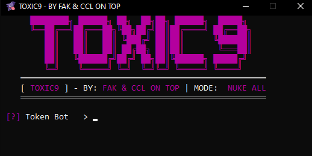

<div align="center">
  
  <h1> TOXIC9 - PAINEL NUKE BOT</h1>
  <p>Suíte avançada de utilitários para automação e testes de estresse em servidores Discord.</p>

  
  
  
</div>

---

## 🛠️ Funcionalidades

| Categoria | Função | Descrição |
| :--- | :--- | :--- |
| **Identidade** | Update Server | Altera nome e ícone do servidor instantaneamente. |
| **Limpeza** | Purge Channels | Deleta todos os canais existentes no servidor alvo. |
| **Ataque** | Dual-Strike | Envia mensagens via Bot e Webhooks simultaneamente. |
| **Injeção** | Mass Node | Cria até 404 canais com webhooks integrados. |
| **UI** | Fixed Panel | Interface travada em tamanho fixo e sem bordas de redimensionamento. |

---

## 📥 Instalação

### Opção 1: Download Direto
1. Baixe a pasta `.zip` do repositório.
2. Extraia os arquivos.
3. Instale as dependências: `pip install -r requirements.txt`.
4. Execute o arquivo `nuke.py` ou o `.exe` na pasta `dist`.

### Opção 2: Via Git
```bash
# Clone o repositório
git clone [https://github.com/SEU_USUARIO/TOXIC9.git](https://github.com/SEU_USUARIO/TOXIC9.git)

# Entre no diretório
cd TOXIC9

# Instale os requisitos
pip install -r requirements.txt

# Execute
python nuke.py
